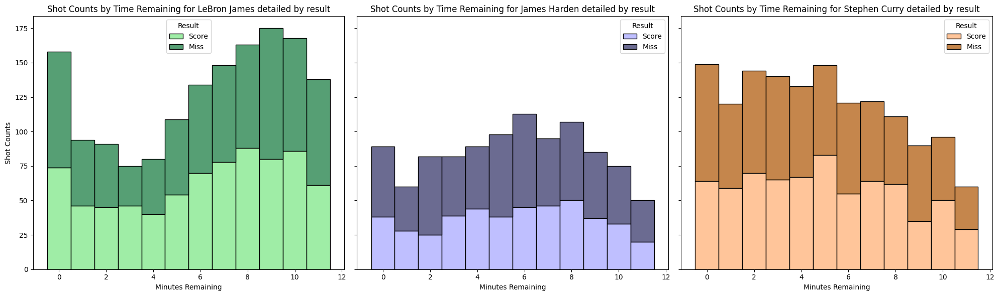

| 🎓 Student's name | SCIPER |
| ----------------- | ------ |
| *Yuwei Liu*       | *368625* |
| *Pablo Soto*      | *383334* |
| *Shiyi Huang*               |*378200*          |

[Milestone 1](#milestone-1) • [Milestone 2](#milestone-2) • [Milestone 3](#milestone-3)

## 🏁 Milestone 1 (29th March, 5pm)

**10% of the final grade**

This is a preliminary milestone to let you set up goals for your final project and assess the feasibility of your ideas.
Please, fill the following sections about your project.

*(max. 2000 characters per section)*

### Dataset

#### NBA 2023 Player Performance Dataset

We have selected the performance data of popular NBA players during the 2023 season as our dataset. This dataset comprises crucial information such as the number of shot attempts, timing, distance, and scoring data. The source databases we have referred to are shown below:

Player Shots Analysis: In-Depth Insights and Performance in 2023: [NBA 2023 Player Shot Dataset](https://www.kaggle.com/datasets/dhavalrupapara/nba-2023-player-shot-dataset)

Player's performance information: [Basketball Reference](https://www.basketball-reference.com/)
[https://www.kaggle.com/datasets/dhavalrupapara/nba-2023-player-shot-dataset](https://www.kaggle.com/datasets/dhavalrupapara/nba-2023-player-shot-dataset)

We'll meticulously processe this data into a visual format to provide a clearer understanding of the strengths exhibited by the players.

### Problematic

The NBA is one of the hottest sports events around the world, and it has several great athletes. Although there is a large amount of data about athletes’ performance in the game on the Internet, these data presents the following problems:

1. **Incomplete Data Processing:** Many data are not fully processed and are in a raw state, lacking systematic organization and analysis.

2. **Poor Data Visualization:** Though some of the athletes' performance data on the web have been processed, the processing is often simple, and always with poor image clarity. These simple processing methods may make the data difficult to understand, confusing the observer.

3. **Lack of Interactivity:** The data lacks dynamic effects and interactivity. It’s not vivid enough for observers to view easily and compare relationships and trends between different players.

Our project focuses on processing and visualizing the shooting data of popular NBA players during the 2023 season. Our goal was to highlight key performance metrics such as shot attempts, accuracy, scoring patterns, and other relevant statistics to provide visually appealing charts of player performance.

Our target audience includes NBA enthusiasts, analysts, fans, and anyone keen on delving deeper into player dynamics. By delivering interactive and informative visualizations, we aspire to empower our audience with enhanced insights to better understand and analyze athlete performance.

### Exploratory Data Analysis

The dataset contain information from three NBA player from 2023 season.

The information un process contains the following columns

Here's a Markdown table with the provided column names, descriptions, data types, and additional information about the range or options:

| Column Name        | Description                                                  | Data Type | 
|--------------------|--------------------------------------------------------------|-----------|
| Player*             | Name of the player (LeBron James, James Harden, Stephen Curry) | String |
| Top                | Vertical position on the court where the shot was taken.    | Numeric   |
| Left               | Horizontal position on the court where the shot was taken.  | Numeric   |
| Angle*              | Shot angle relative to the board, indicating basketball trajectory towards the hoop. | Numeric |
| Date               | Date when the shot was taken (e.g., Oct 18, 2022).          | String    |
| Qtr                | Quarter in which the shot was attempted.                    | String    |
| Time Remaining     | Time remaining in the quarter when the shot was attempted.   | String  |
| Result             | Indicates shot success.                                      | Boolean   |
| Shot Type          | Describes attempted shot type.                               | String    |
| Distance (ft)      | Distance in feet from hoop to shot position.                 | Numeric |
| Lead               | Indicates whether the team was leading during the shot.      | Boolean |
| Team Score  | Team's score (in points) when the shot was taken.           | Numeric   |
| Opponent Team Score| Opposing team's score (in points) when the shot was taken.  | Numeric |
| Opponent           | Abbreviation for the opposing team.                          | String    |
| Team               | Abbreviation for player's team.                             | String    |
| Season             | Season during which shots were taken.                        | Numeric   |
| Color              | Represents the color code associated with the shot.          | String    |

\* note: new columns added to the dataset calculated from given data.

#### Statistical Information from Numerical Data

|       |    top   |   left   | shot_type | distance_ft | team_score | opponent_team_score | season |
|-------|----------|----------|-----------|-------------|-------------------|---------------------|--------|
| count | 3992.000 | 3992.000 | 3992.000  | 3992.000    | 3992.000          | 3992.000            | 3992.0 |
| mean  | 175.107  | 245.341  | 2.444     | 15.829      | 60.269            | 59.195              | 2023.0 |
| std   | 101.824  | 104.620  | 0.497     | 10.816      | 34.789            | 34.793              | 0.0    |
| min   | 26.000   | -3.000   | 2.000     | 0.000       | 0.000             | 0.000               | 2023.0 |
| 25%   | 73.000   | 197.000  | 2.000     | 4.000       | 32.000            | 31.000              | 2023.0 |
| 50%   | 159.000  | 241.000  | 2.000     | 18.000      | 61.000            | 59.000              | 2023.0 |
| 75%   | 279.000  | 301.000  | 3.000     | 26.000      | 89.000            | 88.000              | 2023.0 |
| max   | 389.000  | 483.000  | 3.000     | 36.000      | 140.000           | 135.000             | 2023.0 |

### Related work

> - What others have already done with the data?
> - Why is your approach original?
> - What source of inspiration do you take? Visualizations that you found on other websites or magazines (might be unrelated to your data).
> - In case you are using a dataset that you have already explored in another context (ML or ADA course, semester project...), you are required to share the report of that work to outline the differences with the submission for this class.

## 📈 Milestone 2 (26th April, 5pm)

**10% of the final grade**

## 🎉 Milestone 3 (31st May, 5pm)

**80% of the final grade**

## Late policy

- < 24h: 80% of the grade for the milestone
- < 48h: 70% of the grade for the milestone
