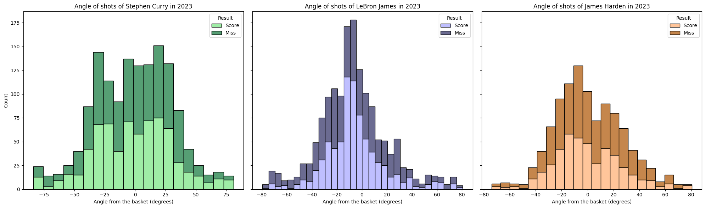

| 🎓 Student's name | SCIPER |
| ----------------- | ------ |
| *Yuwei Liu*       | *368625* |
| *Pablo Soto*      | *383334* |
| *Shiyi Huang*               |*378200*          |

[Milestone 1](#milestone-1) • [Milestone 2](#milestone-2) • [Milestone 3](#milestone-3)
## 📈 Milestone 2 (26th April, 5pm)

Skeleton of our website: [The skeleton of our website](https://com-480-data-visualization.github.io/project-2024-DVteam/)

Link to milestone 2 PDF: [Milestone 2]( https://github.com/com-480-data-visualization/project-2024-DVteam/blob/master/Milestone%202.pdf)

## 🎉 Milestone 3 (31st May, 5pm)

**80% of the final grade**

## 🏁 Milestone 1 (29th March, 5pm)

**10% of the final grade**

This is a preliminary milestone to let you set up goals for your final project and assess the feasibility of your ideas.
Please, fill the following sections about your project.

*(max. 2000 characters per section)*

### Dataset

#### NBA 2023 Player Performance Dataset

We have selected the performance data of popular NBA players during the 2023 season as our dataset. This dataset comprises crucial information such as the number of shot attempts, timing, distance, and scoring data. The source databases we have referred to are shown below:

Player Shots Analysis: In-Depth Insights and Performance in 2023: [NBA 2023 Player Shot Dataset](https://www.kaggle.com/datasets/dhavalrupapara/nba-2023-player-shot-dataset)

Player's performance information: [Basketball Reference](https://www.basketball-reference.com/)
[https://www.kaggle.com/datasets/dhavalrupapara/nba-2023-player-shot-dataset](https://www.kaggle.com/datasets/dhavalrupapara/nba-2023-player-shot-dataset)

We'll meticulously processe this data into a visual format to provide a clearer understanding of the strengths exhibited by the players.

### Problematic

The NBA is one of the hottest sports events around the world, and it has several great athletes. Although there is a large amount of data about athletes’ performance in the game on the Internet, these data presents the following problems:

1. **Incomplete Data Processing:** Many data are not fully processed and are in a raw state, lacking systematic organization and analysis.

2. **Poor Data Visualization:** Though some of the athletes' performance data on the web have been processed, the processing is often simple, and always with poor image clarity. These simple processing methods may make the data difficult to understand, confusing the observer.

3. **Lack of Interactivity:** The data lacks dynamic effects and interactivity. It’s not vivid enough for observers to view easily and compare relationships and trends between different players.

Our project focuses on processing and visualizing the shooting data of popular NBA players during the 2023 season. Our goal was to highlight key performance metrics such as shot attempts, accuracy, scoring patterns, and other relevant statistics to provide visually appealing charts of player performance.

Our target audience includes NBA enthusiasts, analysts, fans, and anyone keen on delving deeper into player dynamics. By delivering interactive and informative visualizations, we aspire to empower our audience with enhanced insights to better understand and analyze athlete performance.

### Exploratory Data Analysis

We have pre-processed the data collected from these two sites to include the shooting performance of LeBron James, James Harden, and Stephen Curry during the 2023 NBA season. Our preprocessing included scatter plots of all shots, two-point shots and three-point shots by three players and bar plots of shots' angle and distance by them, respectively. The collation gives us an initial idea of the type and size of the data, which is useful for further visualization.

Here's a Markdown table with the provided column names, descriptions, data types, and additional information about the range or options:

| Column Name        | Description                                                  | Data Type | 
|--------------------|--------------------------------------------------------------|-----------|
| Player*             | Name of the player (LeBron James, James Harden, Stephen Curry) | String |
| Top                | Vertical position on the court where the shot was taken.    | Numeric   |
| Left               | Horizontal position on the court where the shot was taken.  | Numeric   |
| Angle*              | Shot angle relative to the board, indicating basketball trajectory towards the hoop. | Numeric |
| Date               | Date when the shot was taken (e.g., Oct 18, 2022).          | String    |
| Qtr                | Quarter in which the shot was attempted.                    | String    |
| Time Remaining     | Time remaining in the quarter when the shot was attempted.   | String  |
| Result             | Indicates shot success.                                      | Boolean   |
| Shot Type          | Describes attempted shot type.                               | String    |
| Distance (ft)      | Distance in feet from hoop to shot position.                 | Numeric |
| Lead               | Indicates whether the team was leading during the shot.      | Boolean |
| Team Score  | Team's score (in points) when the shot was taken.           | Numeric   |
| Opponent Team Score| Opposing team's score (in points) when the shot was taken.  | Numeric |
| Opponent           | Abbreviation for the opposing team.                          | String    |
| Team               | Abbreviation for player's team.                             | String    |
| Season             | Season during which shots were taken.                        | Numeric   |
| Color              | Represents the color code associated with the shot.          | String    |

\* note: new columns added to the dataset calculated from given data.

#### Statistical Information from Numerical Data

|       |    top   |   left   | shot_type | distance_ft | team_score | opponent_team_score | season |
|-------|----------|----------|-----------|-------------|-------------------|---------------------|--------|
| count | 3992.000 | 3992.000 | 3992.000  | 3992.000    | 3992.000          | 3992.000            | 3992.0 |
| mean  | 175.107  | 245.341  | 2.444     | 15.829      | 60.269            | 59.195              | 2023.0 |
| std   | 101.824  | 104.620  | 0.497     | 10.816      | 34.789            | 34.793              | 0.0    |
| min   | 26.000   | -3.000   | 2.000     | 0.000       | 0.000             | 0.000               | 2023.0 |
| 25%   | 73.000   | 197.000  | 2.000     | 4.000       | 32.000            | 31.000              | 2023.0 |
| 50%   | 159.000  | 241.000  | 2.000     | 18.000      | 61.000            | 59.000              | 2023.0 |
| 75%   | 279.000  | 301.000  | 3.000     | 26.000      | 89.000            | 88.000              | 2023.0 |
| max   | 389.000  | 483.000  | 3.000     | 36.000      | 140.000           | 135.000             | 2023.0 |

#### Results in Shots Metrics: What is the place on the court where players score the most?

We can see two peaks in the graph, first at a short distance from the rim and later at a distance equivalent to the 3-point line. We can also distinguish that shots at short distance are more effective than at long distance.

It is possible to see that most of the shots are made from a position facing the rim and less from the sides of the court. These differences are accentuated depending on the player, and it is possible to notice it slightly in the figures of the shot from the field, where the position is seen like the following figure

#### Taking Time into Account: Is there a strategy that depends on the time remaining in the game?

In a player we can see a big difference in making more shots in the last seconds. However, in the rest there is also an increase for the last remaining minute.

It is possible to see that regardless of the number of minutes remaining, there is no clear trend of the place or type of launch as time progresses.

Although there is an increase in the shots made in the last minutes of the game, there is no such increase (or it is not considerably greater) for the success of the shots.

#### Leading Status: Is there a change in behavior when they are losing or winning?

It is not possible to notice a trend in the distribution of shots depending on whether they are winning the game or not. In all cases shots are seen at different distances and angles.

We can see in the figure that there is no change in behavior in terms of the type of shot depending on whether they are winning or losing.

It can be interpreted from the graph that when they are losing there is a greater number of missed shots than successful ones and this trend reverts to when they are winning. Only in the case of James Harden, when they win, there is no significant difference in the number of successes and failures.

#### Exploratory Data Analysis Conclusions
Analysis of LeBron James, James Harden, and Stephen Curry's shooting performance during the 2023 NBA season reveals consistent trends. Shots are most successful near the rim and from three-point range, with a preference for frontal shots. While more shots are attempted in the final seconds of quarters, success rates don't always increase, indicating potential risk-taking. Shot selection remains consistent throughout the game, irrespective of time or game situation. Additionally, there's little difference in shot distribution based on winning or losing, though more missed shots occur when the team is behind. Overall, players demonstrate consistent shooting strategies and adaptability, with minimal influence from external factors on their performance.

### Related work
#### Others' work
For this dataset, previous analyses conducted by others include a "Last Minutes Shot Analysis" and other preliminary data analysis and visualization using
`sns` and `AutoViz`. Here are the links:  

**Last Minutes Shot Analysis**: https://www.kaggle.com/code/aqsasadaf/last-minutes-shot-analysis/notebook  

**preliminary data analysis**: https://www.kaggle.com/code/deepanshuluthra/nba-player-shot-analysis/notebook, https://www.kaggle.com/code/ryotapy/nba-player-shot-dataset-2023/notebook

#### Originality
**Comprehensive and Multi-Faceted Analysis**: Our analysis goes beyond basic statistics to incorporate various aspects like shot distance, angle, time remaining, and game status (leading or trailing). This multi-dimensional approach provides a more holistic understanding of player performance.  

**Interactive Visualizations**: Our focus on creating interactive and dynamic visualizations offers a more engaging way to explore the data. This method makes it easier for users to understand complex patterns and draw meaningful conclusions.  

**Time and Situation-Based Insights**: Analyzing player performance based on the time remaining in the game and their team's leading status adds a strategic dimension to our analysis. This approach helps in understanding how pressure and game context influence player decisions and performance.

#### Inspiration
We will reference various sports analysis websites and magazines. For instance, the visualizations in ESPN's NBA section or the analyses in Sports Illustrated offer deep insights into player performance with interactive and visually appealing formats. Websites like FiveThirtyEight provide a unique combination of statistical rigor and accessible visualization styles, which can inspire our work. Additionally, although not the same dataset, similar NBA data has been processed by others, such as the 2014-2015 season's data. There are many related repositories on GitHub (such as https://github.com/SergioLlana/nba-shot-analysis), and we will draw from similar processing methods.

## Late policy

- < 24h: 80% of the grade for the milestone
- < 48h: 70% of the grade for the milestone
